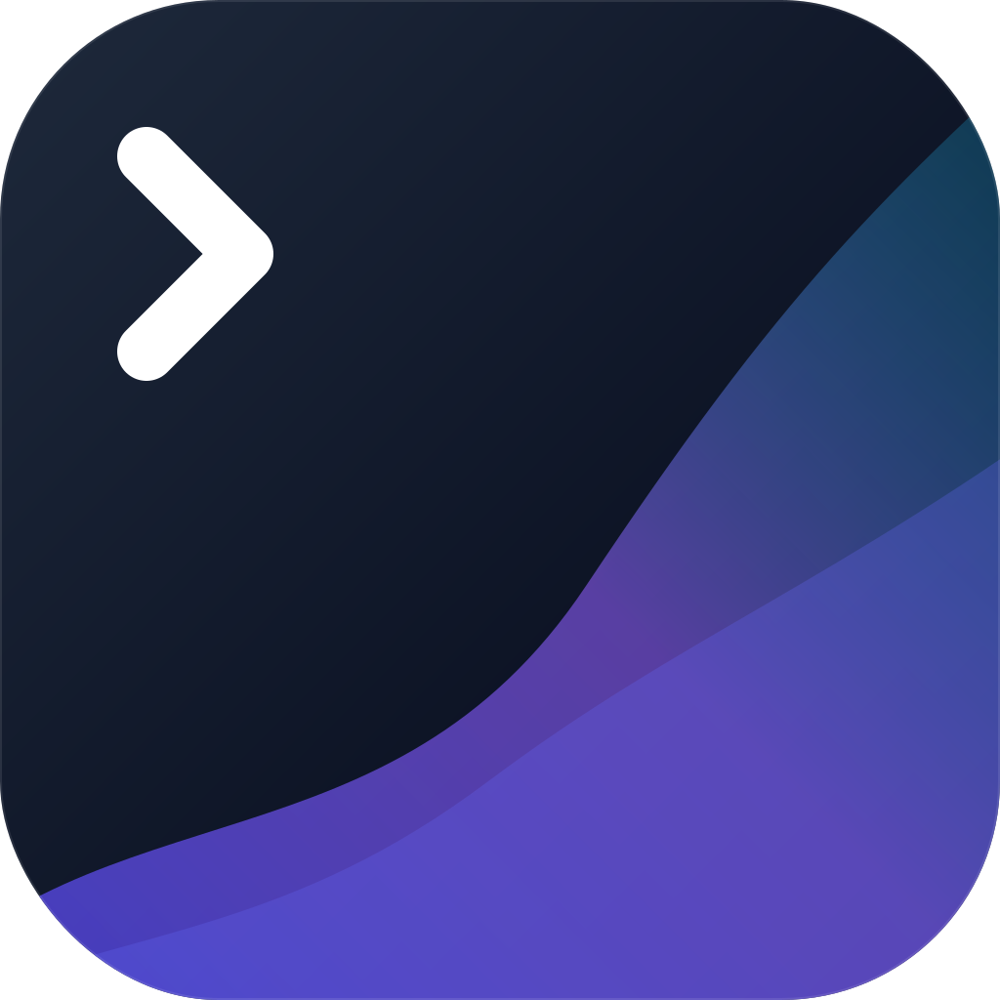
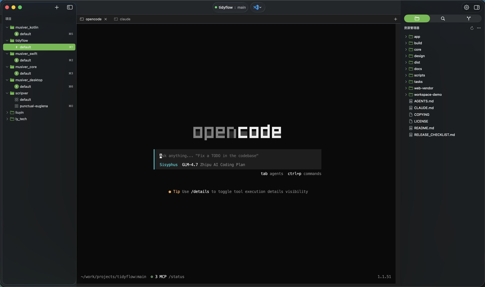

<p align="center">
  
</p>

<h1 align="center">TidyFlow</h1>

<p align="center">
  <strong>专为专业开发者打造的 macOS 原生多项目并行开发工具</strong>
</p>

<p align="center">
  <a href="LICENSE"></a>
  <a href="https://www.apple.com/macos/"></a>
  <a href="https://www.rust-lang.org/"></a>
  <a href="https://developer.apple.com/xcode/swiftui/"></a>
</p>

---

## 🌟 什么是 TidyFlow?

TidyFlow 是一款 macOS 原生的工作流管理工具，旨在解决开发者在多项目、多分支开发时频繁切换上下文的痛点。

如果你需要并行开发多个项目，并行开发多个功能，需要频繁在不同 AI Agent 之间切换，偶尔需要查看/编辑文件内容，那么 TidyFLow 可能就是你需要的。

> "让你的开发流程像流水一样顺畅。"

## ✨ 核心特性

- 📂 **多项目并行管理**：在一个界面中同时管理多个独立项目，互不干扰。
- 🌿 **Git Worktree 原生支持**：基于 Git Worktree 实现真正的分支隔离，无需 `git stash` 或频繁切分支，多个分支同时开发。
- 💻 **VS Code 级终端体验**：集成 xterm.js + 真实 PTY，完美支持 `vim`、`tmux`、`htop` 等复杂 TUI 工具，支持 256 色及 TrueColor。
- 🍎 **纯正 macOS 原生体验**：使用 SwiftUI + AppKit 构建，遵循 macOS HIG，支持快捷键全键盘操作。
- 🚀 **极致性能**：Rust 编写的核心后端，冷启动秒开，Workspace 创建瞬间完成。
- 🛠️ **自动化环境准备**：克隆项目后自动检测类型并执行 `setup` 脚本，开箱即用。

> 部分功能暂未实现，以实际使用为准。

## 📸 界面预览



## 🏗️ 技术架构

TidyFlow 采用现代化的**混合原生架构**：

- **Frontend (UI Shell)**: 使用 SwiftUI 和 AppKit 构建的 macOS 原生应用，负责窗口管理和系统集成。
- **Terminal Container**: 通过 WKWebView 承载 xterm.js，提供业界标准的高性能终端渲染。
- **Core Engine (Backend)**: 由 Rust 编写的高性能引擎，处理 PTY 管理、Git 操作、文件系统和状态持久化。
- **Communication**: 前后端通过 JSON-RPC 2.0 协议在 WebSocket 上进行高效通信。

## ⌨️ 常用快捷键

### 全局操作
- `Cmd + Shift + P`: 打开命令板 (Command Palette)
- `Cmd + P`: 快速打开文件 (Quick Open)
- `Cmd + R`: 重新连接后端引擎

### 工作区操作
- `Cmd + T`: 新建终端 Tab
- `Cmd + W`: 关闭当前 Tab
- `Ctrl + Tab`: 切换下一个 Tab
- `Ctrl + Shift + Tab`: 切换上一个 Tab

## 🛠️ 如何构建

如果你想从源代码构建 TidyFlow，请确保你的系统已安装 **Rust** 和 **Xcode**。

### 1. 快速启动 (推荐)
```bash
./scripts/run-app.sh  # 自动构建核心引擎、应用并启动
```

### 2. 手动构建核心 (Rust Core)
```bash
cd core
cargo build --release
```

### 3. 手动构建应用 (macOS App)
```bash
open app/TidyFlow.xcodeproj  # 使用 Xcode 打开并运行 (Cmd+R)
```

## 📦 打包发布

项目支持自动化的签名与公证流程，确保在其他 macOS 设备上顺畅运行。

- **构建未签名 DMG**: `./scripts/build_dmg.sh`
- **签名构建**: `SIGN_IDENTITY="Developer ID..." ./scripts/build_dmg.sh --sign`
- **公证**: `./scripts/notarize.sh --profile tidyflow-notary`

## 📄 开源协议

本项目采用 **LGPL-3.0** 协议开源。
详细内容请参阅 [LICENSE](LICENSE) 与 [COPYING](COPYING)。
